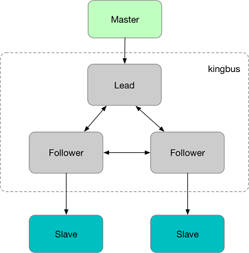

# kingbus简介

kingbus是一个基于raft强一致协议实现的分布式MySQL binlog 存储系统。它能够充当一个MySQL Slave从真正的Master上同步binglog，并存储在分布式集群中；同时又充当一个MySQL Master将集群中的binlog 同步给其他Slave。kingbus具有如下特性：

* 兼容MySQL 复制协议，**通过Gtid方式同步**Master上的binlog，同时支持slave通过Gtid方式从kingbus拉取binlog。

* 跨地域数据复制，kingbus通过raft协议支持跨地域间的数据复制。写入到集群的binlog数据在多个节点间保证强一致，并保证binlog顺序与master上完全一致。

* 高可用，由于kingbus是构建在Raft强一致协议之上，能够实现集群中过半数节点存活的情况下，整个binlog拉取和推送服务高可用。

# 为什么需要kingbus？

1. 降低Master的负载和网络传输流量。在一主多从的复制拓扑中，Master需要发送binlog到各个slave，如果slave过多的话，网络流量很有可能达到Master的网卡上限，同时Master上负载也会过高。
2. 简化主从复制拓扑，不再需要多级复制。
3. 简化Master Failover流程，只需将其中的一个Slave提升为Master，并将kingbus指向新的Master，其他slave复制拓扑保持不变。
4. 减少Master上的binlog存储空间，将binlog都存储到kingbus中。
5. 支持异构复制。其他异构复制组件可以连接在kingbus上。

更多使用场景，可以参考:

* Booking: [Binlog server at booking](https://medium.com/booking-com-infrastructure/mysql-slave-scaling-and-more-a09d88713a20)

* Facebook: [Binlog server at facebook](docs/binlog_server_at_fackbook.pdf)

* Google: [mysql-ripple](https://github.com/google/mysql-ripple)

## Quick Start

Read the [Quick Start](docs/cn/quick_start.md)

## License

kingbus采用Apache 2.0协议，相关协议请参看[目录](LICENSES)

## 文档

1.[kingbus的架构与设计](docs/cn/architecture.md)

2.[Kingbus 管理API说明](docs/cn/admin_api.md)

3.[通过docker-compose创建kingbus集群](docs/cn/docker_compose.md)

4.[kingbus架构设计之如何伪装成MySQL Master角色](docs/cn/become_master.md)

## 反馈

* 如果您在使用kingbus的过程中发现BUG或者有新的功能需求，请提issue。
* 如果想跟作者沟通交流，请发邮件至hiflike#126.com与作者取得联系，或者加入QQ群(232606162)交流。
* 欢迎关注**后端技术快讯**公众号，有关kingbus的最新消息与后端架构设计类的文章，都会在这个公众号分享。

## 致谢

- 感谢[etcd](https://github.com/etcd-io/etcd/tree/master/raft)提供的raft library。
- 感谢[go-mysql](https://github.com/siddontang/go-mysql)提供的相关MySQL协议解析库。
