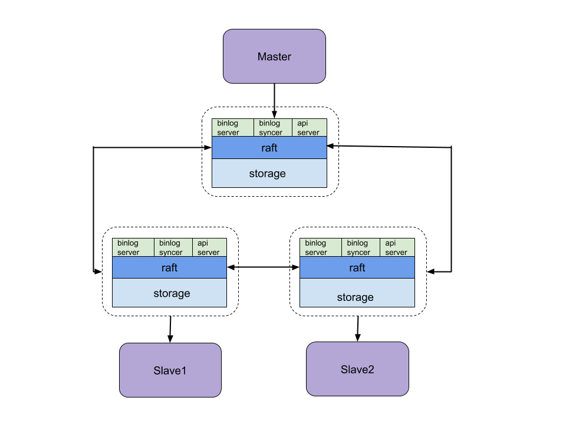
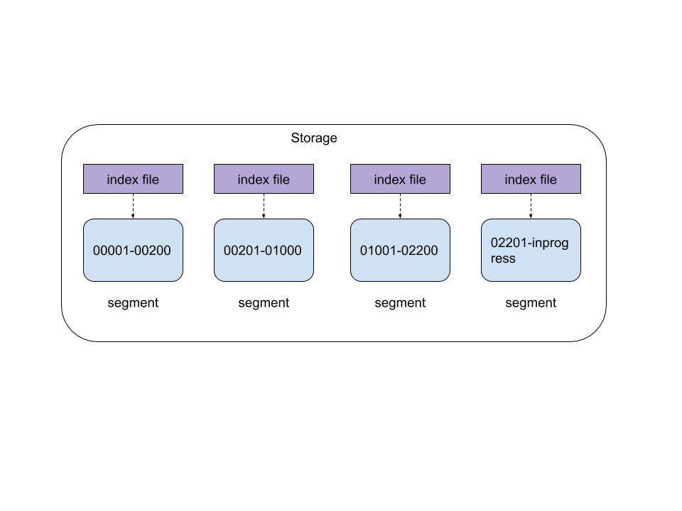

## 1. kingbus简介

### 1.1 kingbus是什么？

kingbus是一个基于raft强一致协议实现的分布式MySQL binlog 存储系统。它能够充当一个MySQL Slave从真正的Master上同步binlog，并存储在分布式集群中。同时又充当一个MySQL Master将集群中的binlog 同步给其他Slave。
kingbus具有如下特性：

* 兼容MySQL 复制协议，通过Gtid方式同步Master上的binlog，同时支持slave通过Gtid方式从kingbus拉取binlog。
* 跨地域数据复制，kingbus通过raft协议支持跨地域间的数据复制。写入到集群的binlog数据在多个节点间保证强一致，并保证binlog顺序与master上完全一致。
* 高可用，由于kingbus是构建在Raft强一致协议之上，能够实现集群中过半数节点存活的情况下，整个binlog拉取和推送服务高可用。

### 1.2 kingbus能解决什么问题？

* kingbus能降低Master的网络传输流量。在一主多从的复制拓扑中，Master需要发送binlog到各个slave，如果slave过多的话，网络流量很有可能达到Master的网卡上限。例如在Master执行delete大表或者online DDL等操作，都有可能造成瞬间生成大量的binlog event，如果master下面挂10台slave的话，master上的网卡流量就会放大10倍。如果master使用千兆网卡，产生了10MB/S以上的流量就有可能将其网卡跑满。通过kingbus连接master的方式，可以将slave分散到多台机器上，从而均衡传输流量。
* 简化Master Failover流程，只需将连接在kingbus上的一台Slave提升为Master，并将kingbus重新指向新的Master，其他slave依旧连接在kingbus上，复制拓扑保持不变。
* 节省Master存储binlog文件的空间。一般MySQL上都是较为昂贵的SSD，如果binlog文件占用空间较多，就使得MySQL存储的数据不得不降低。可以通过将binlog都存储到kingbus中，从而降低Master上binlog文件的存储数量
* 支持异构复制。通过阿里巴巴开源的canal连接到kingbus，kingbus源源不断推送binlog给canal，canal接收完binlog再推送给kafka消息队列，最终存入HBase里，业务部门通过Hive直接写SQL的方式来实现业务的实时分析。

## 2.kingbus总体架构

kingbus整体架构如下图所示：

* storage负责存储raft log entry和Metadata，在kingbus中，将raft log和mysql binlog融合在一起了，通过不同的头部信息区分，raft log的数据部分就是binlog event，这样就不需要分开存储两类log，节省存储空间。因为kingbus需要存储一些元信息，例如raft 节点投票信息、某些特殊binlog event的具体内容（FORMAT_DESCRIPTION_EVENT）。
* raft复制kingbus集群的Lead选举、日志复制等功能，使用的是etcd raft library。
* binlog syncer，只运行在Raft集群的Lead节点上，整个集群只有一个syncer。syncer伪装成一个slave，向Master建立主从复制连接，Master会根据syncer发送的executed_gtid_set过滤syncer已经接受的binlog event，只发送syncer没有接收过的binlog event，这套复制协议完全兼容MySQL 主从复制机制。syncer收到binlog event后，会根据binlog event类型做一些处理，然后将binlog event封装成一个消息提交到raft 集群中。通过raft算法，这个binlog event就可以在多个节点存储，并达到强一致的效果。
* binlog server，就是一个实现了复制协议的Master，真正的slave可以连接到binlog server监听的端口，binlog server会将binlog event发送给slave，整个发送binlog event的过程参照MySQL 复制协议实现。当没有binlog event发送给slave时，binlog server会定期发送heartbeat event给slave，保活复制连接。
* api server，负责整个kingbus集群的管理，包括以下内容：
    * raft cluster membership操作，查看集群状态，添加一个节点、移除一个节点，更新节点信息等
    * binlog syncer相关操作，启动一个binlog syncer，停止binlog syncer，查看binlog syncer状态。
    * binlog server相关操作，启动一个binlog server，停止binlog server，查看binlog server状态。
server层的各种异常，都不会影响到raft层，server可以理解为一种插件，按需启动和停止。以后扩展kingbus时，只需要实现相关逻辑的server就行。例如实现一个kafka协议的server，那么就可以通过kafka client消费kingbus中的消息。

## 3.kingbus核心实现
### 3.1 storage的核心实现
storage中有两种日志形态，一种是raft日志（以下称为raft log），由raft算法产生和使用，另一种是用户形态的Log（也就是mysql binlog event）。Storage在设计中，将两种Log形态组合成一个Log Entry。只是通过不同的头部信息来区分。Storage由数据文件和索引文件组成，如下图所示：

* segment固定大小（1GB），只能追加写入，名字为first_raft_index-last_raft_index，表示该segment的raft index范围。
* 只有最后一个segment可写，其文件名为first_raft_index-inprogress，其他segment只读。
* 只读的segment和对应的index file都是通过mmap方式写入和读取。
* 最后一个segment的index 内容同时存储在磁盘和内存。读取索引是只需要在内存中读取。

### 3.2 etcd raft库的使用
Etcd raft library在处理已经Apply的日志、committed entries等内容时，是单线程处理的。具体函数参考链接，这个函数处理时间要确保尽可能短，如果处理时间超过raft 选举时间，会造成集群重新选举。这一点需要特别注意。
### 3.3 binlog syncer的核心实现
binlog syncer主要工作就是：
* 拉取binlog event
* 解析并处理binlog event
* 提交binlog event到raft 集群。
很明显可以通过pipeline机制来提个整个过程的处理速度，每个阶段kingbus都使用单独的goroutine来处理，通过管道来衔接不同阶段。
由于binlog syncer是按照binlog event一个一个接收的，syncer并不能保证事务完整性，有可能在syncer挂了后，需要重新连接Master，这时候最后一个事务有可能不完整，binlog syncer需要有发现事务完整性的能力，kingbus实现了事务完整性解析的功能，完全参考MySQL源码实现。
### 3.4 binlog server的核心实现
binlog server实现了一个master的功能，slave与binlog server建立复制连接时，slave会发送相关命令，binlog server需要响应这些命令。最终发送binlog event给slave。对于每个slave，binlog server会启动一个goroutine不断读取raft log，并去掉相关头部信息，就变成了binlog event，然后再发送给slave。
## 4. 总结
本文简要介绍了kingbus整体架构和核心组件及流程，通过这篇文章，希望读者对kingbus有个较为全面的认识。

