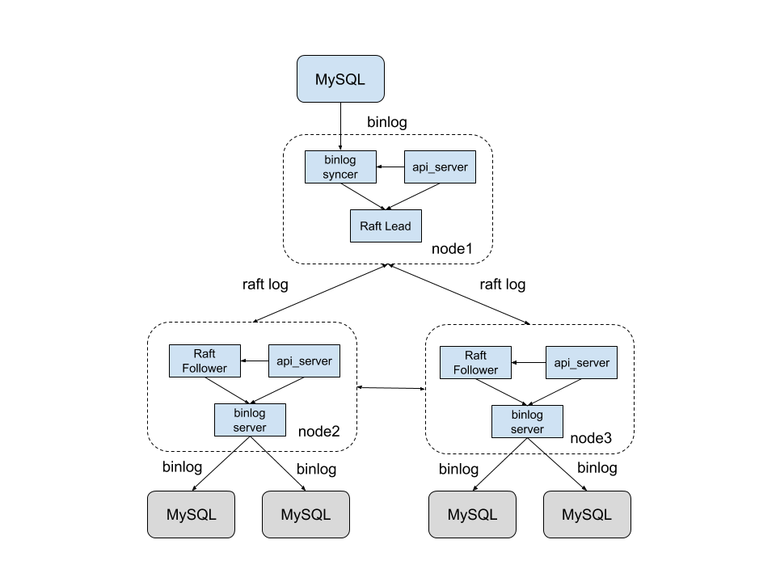

## 1.Get and run kingbus

The `master` branch may be in an *unstable or even broken state* during development. Please use [releases](https://github.com/flike/kingbus/releases) instead of the `master` branch in order to get stable binaries. Kingbus is a raft cluster. It is best to start three processes and distribute them on three machines. For example, deploying kingbus on the following network topology.



Follow the steps below to install and run kingbus:

1. Install Go。
2. download kingbus.tar.gz from releases page into  $GOPATH/src/github.com/flike/kingbus
3. cd $GOPATH/src/github.com/flike/kingbus
4. tar -zxvf kingbus.tar.gz
5. make
5. set the config file。
6. run kingbus:  nohup ./bin/kingbus -config=etc/kingbus.yaml &

## 2. Run binlog syncer
The user can start the binlog syncer service on the leader node of the Raft Cluster through the http API. The service will pretend to be a slave and synchronize the binlog from the Real Master. The startup command is as follows:

```
curl -H "Content-Type:application/json" -X PUT --data '{"syncer_id":1001,"syncer_uuid":"f7e30637-f15a-11e8-accc-244427b6b60e","mysql_addr":"192.168.1.150:3415","mysql_user":"kb","mysql_password":"kb","semi_sync":false}' http://192.168.1.150:9595/binlog/syncer/start
```

There are several parameters in the PUT request, the meaning is as follows:

- syncer_id: an integer corresponding to the syncer's id, relative to the server_id in mysql
- syncer_uuid: string type, corresponding to uuid syncer, relative to server_uuid in mysql
- mysql_addr: string type, format: IP:PORT, which represents the IP and port of the Real Master.
- mysql_user: The username used by the sync master to connect to the Real Master. If it does not exist, it needs to be created on the Real Master in advance, and has the corresponding copy permission.
- mysql_password: The password used by syncer to connect to Real Master.
- semi_sync: Synchronize binlog to enable semi-synchronization.

## 3.Run binlog server

Start binlog server on any of the kingbus instances. The binlog server is equivalent to a MySQL Master, which responds to the slave's request to copy the binlog and continuously pushes the binlog to the slave. The startup command is as follows:


```
curl -H "Content-Type:application/json" -X PUT --data '{"addr":"192.168.1.149:3390","user":"kb","password":"kb"}' http://192.168.1.149:9595/binlog/server/start
```


There are several parameters in the PUT request, the meaning is as follows:

- addr: address that binlog server listens on
- user: the username used by the slave to connect to the binlog server
- password: the password used by the slave to connect to the binlog server

## 4. MySQL full backup generation and import

We have started a binlog server service on an instance of kingbus, we need to import a full backup of the real master to the slave before starting the replication. You can use mysqldump, xtrabackup, [mydumper] (https://github.com/maxbube/mydumper)
and other tools to complete this operation, the following I use mysqldump as an example to show the process of generating a full backup on the real master and importing to the slave:

1. Generate a full backup on the master

```
./mysqldump -h127.0.0.1 -uroot -P3415 --all-databases --single-transaction >/home/kb/full_backup.sql
```

2. Import a full backup to the slave

Copy full_backup.sql to the slave machine and import the full backup:

```
#Clear the slave's Executed_Gtid_Set, otherwise it will occurre an error during the import process.
MySQL [(none)]> reset master
MySQL [(none)]> quit
```

```
mysql -h127.0.0.1 -uroot -P3415 <./full_backup.sql
```

## 5. Start the slave
After importing the full backup, the slave can now start the replication. The replication command is the same as the native setup master-slave replication command:

```
CHANGE MASTER TO MASTER_HOST = '192.168.1.149', MASTER_USER = 'kingbus', MASTER_PASSWORD = 'kingbus', MASTER_PORT = 3390, MASTER_AUTO_POSITION = 1, MASTER_RETRY_COUNT = 0, MASTER_HEARTBEAT_PERIOD = 100;
```

Start the slave io thread and sql thread

```
start slave
```

## 6.Remarks

1. Normally, there is data in the real master, and the slave also has full backup. At this time, you need to start the syncer in the kingbus first.
Wait for the binlog synchronization bit (gtid_set) in the kingbus to exceed the slave before you can connect the slave to the binlog server. Otherwise, the synchronization will fail because it is not satisfied in the binlog server.
The latest log.